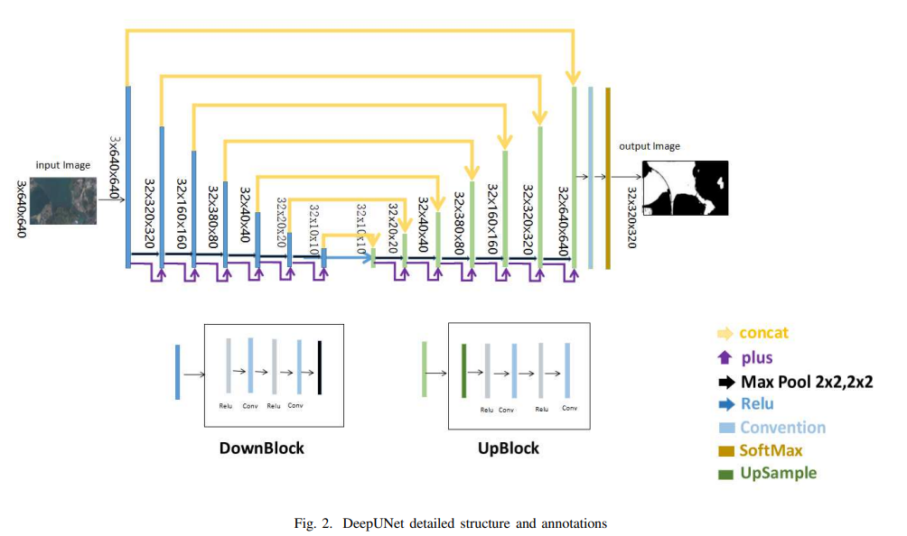

# Эксперименты

Соответсвующие эксперименты можно найти в блокнотах в этой же директории

## Эксперименты с UNet

### Baseline
В первую очередь для решения данной задачи я решил реализовать [UNet](https://arxiv.org/abs/1505.04597), поскольку это довольно простая и популярная сеть.
При запуске я решил воспользоваться рядом аугментаций: повороты на небольшие градусы, горизонтальная симметрия, изменения масштаба и перспективы, вырезание
небольших кусочков. Первые типы аугментаций не влияют на естесвенность фотографий, а аугментация с вырезанием квадратов должна помочь с тем чтобы более явно
выделять границы силуэта. При запуске бейзлайна я воспользовался оптимизатором Adam c дефолтными параметрами. Несмотря на то что, использование dice loss в 
качестве лосс функций может на первый взгляд показаться естесвенным в задаче по оптимизации dice после первого запуска я получил достаточно плохие результаты
и отказался от этой идеии. Я решил использовать кросс-энтропию.

### NoCrop
После получения базовго пайплайна я обратил внимание на то, что моя модель достаточно часто может оставлять пустые зоны внутри силуэтов или проводить границы 
по элементам одежды. Таким образом я решил убрать из аугментаций вырезание квадратиков, однако это только ухудшило результат.

### ExtraCrop
Я обратил внимание, что иногда модель не может выделить человека на фоне какого-то одноцветного фона или не может отличить элементы одежды от этого фона.
Таким образом я пришел к идее, что я мог бы добавить аугментации, который вырезали бы квадратики и на их место добавляли закрашенные области нескольких цветов,
я взял красный, зеленый и синий. Такая аугментация не привела к улучшению моей модели.

### OpticalDistortion
Так же выбирая из возможных аугментаций я решил попробовать сделать оптические преобразования с картинкой, к несчастью такой эксперимент тоже не принес 
улучшений

### ChangingLoss
При рассмотрении датасета я обратил внимание, что на фотографиях на которых присутсвует только лицо человека образуются гладкие контуры, тогда как 
фотографии в полный рост имеют гораздо более сложный силуэт. При этом фотографии, на которых человек изображен в полный рост есть явный дисбаланс классов.
Это натолкнуло меня на мысль, что можно было бы брать взвешенную энтропию вместо обычной. Я рассмотрел два варианта эксперимента, они оба не дали 
улучшений и на этом я решил попробовать перейти к другой модели.

## Эксперименты с DeepUNet

### Baseline
Мне показалось осмысленным, попробовать использовать в данной задаче residual connections и возможно увелчить глубину сети. При рассмотрении различных 
статей я обнаружил [DeepUNet](https://arxiv.org/pdf/1709.00201.pdf). Так как в нашем случае мы имеем достаточно маленькие изображения, то из-за пулингов
просто увеличить количество сверточных слоев не получится, но можно увеличить количество сверток на каждом уровне. Изначально я запустил обычный UNet 
в котором просто добавил residual connection, но это лишь ухудшило результат. Возможно это было связано с тем, что использование суммы не позволяет увеличивать количество слоев на одном сверточном уровне.

### MoreLayers
После этого я решил удвоить количество сверток. В данном случае это позволило повторить результат UNet

### TwoNets
У меня возникла мысль, что имеет смысл рассматривать так же свертки с ядрами большего размера, чтобы сеть смогла распознавать более крупные объекты. К тому же само восприятие нейронной сети в качестве буквы U наталкивает на мысль сочетания нескольких таких букв с разными параметрами. В итогов эксперименте я добавил еще одну U с одинаковым количество сверточных слоев, заменив на каждом слое свертку 3x3 на 7x7 и уменьшив их количество. После, результаты этих сетей складываются. Данная идея позволила улучшить результат на несколько процентов. 

### SumNets
Я решил попробовать и заменить сложение двух результатов U на их конкатенацию, но это лишь ухудшило значение.

## Возможные дальнейшие эксперименты

В дальнейшем можно провести так же несколько экспериментов модернизируя DeepUNet, рассматривая различные аугментации, lr и лосс-функции по аналогии с UNet, однако вполне возможно что данный подход не даст результатов, поэтому на мой взгляд он не самый приоритетный. Стоит отметить, что основная идея которая увеличила производительность DeepUNet &mdash; несколько сетей параллельно, так же работает и для обычного UNet и возможно стоит рассмотреть такую модернизацию UNet. В этом же направлении стоит провести несколько экспериментов по добавлению других сверточных уровней, комбинированию различных сверток
